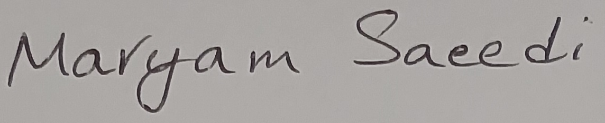

# DeepLearning7
The 7th assignement of DeepLearning course- OCR

## Inferences of easyOCR

### Inferences on latin hand-writing text images

- Image:

- Result:

    ['Marttam', 'Saee&;']

- Image:

- Result:

    ['Py tkon', '@laSS']

### Inferences on persian hand-writing text images

- Image:

- Result:

    ['سورکِ']

- Image:

- Result:

    ['اِ رءل', 'زورد']

### Inferences on latin license plate images

- Image:

- Result:

    ['LXI2 HUJ']

- Image:

- Result:

    ['AND', 'OX6S']

### Inferences on persian license plate images
- Image:

- Result:

    ['٢٥؛', '٣١٣٧٤']

- Image:

- Result:

    ['٦٦٢٧ی']